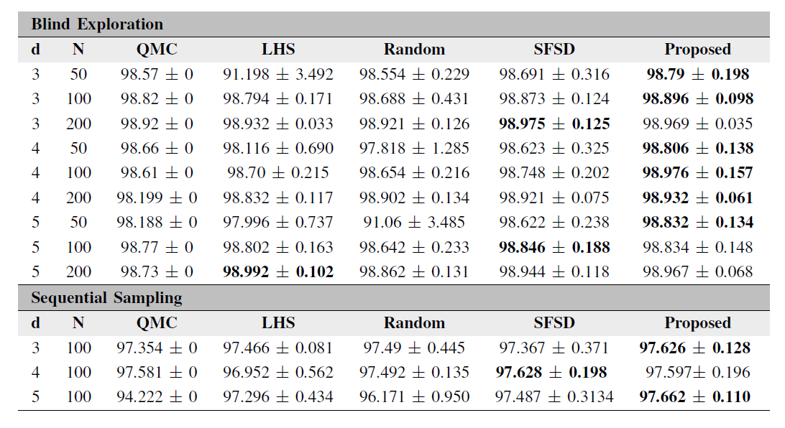
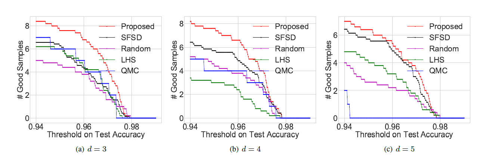
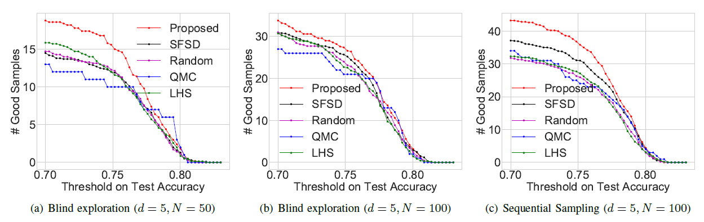
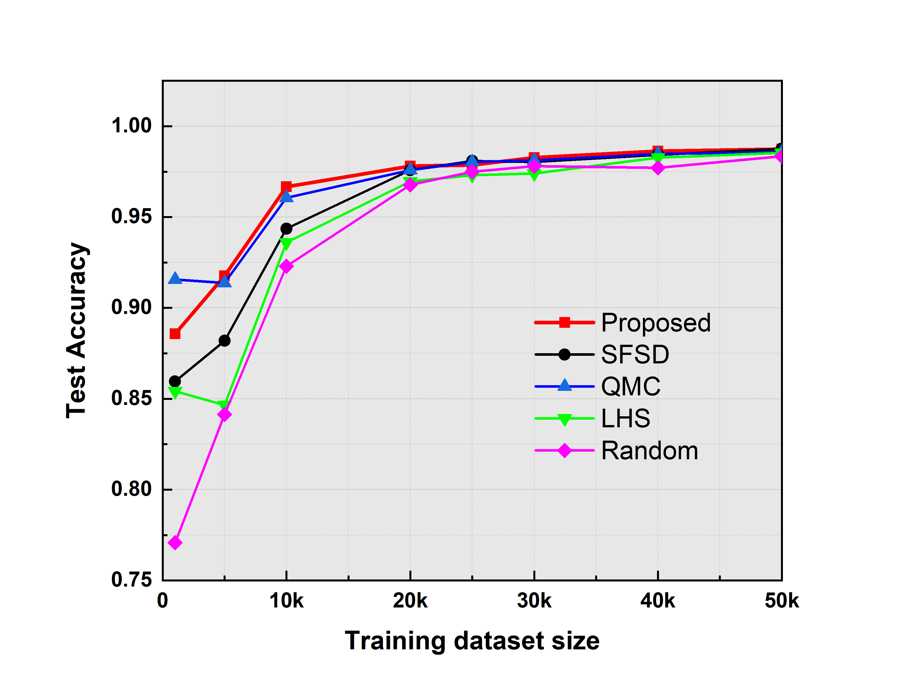

# Coverage-Based Designs Improve Sample Mining and Hyper-Parameter Optimization

## Codes Description:

#### ---example.py:
        This is an example script for synthesizing samples with desired characteristics

#### --- SFSD.py :
                This code generate space filling spectral designs (SFSD).
        	SFSD.__init__            :: defaults
        	SFSD.choose_sigma	 :: snippet to choose sigma based on dimension
        	SFSD.edge_correction     :: Computing the edge correction factor
        	SFSD.G_kern              :: Faster Gaussian kernel computation
        	SFSD.r_min               :: r_min for step design
        	SFSD.initial_calculation :: defining PCF and initial calculation
        	SFSD.generate		 :: Sample generation

#### --- optimal_params.py :
	optimal_params.__init__             :: defaults
	optimal_params.rmin                 :: initial r0 by r_min of step design
	optimal_params.r_1                  :: initial r1 >> r0
	optimal_params.PSD                  :: Compute power spectral density
	optimal_params.compute_params       :: optimization procedure to find optimal r0 and r1

#### --- blind_exploration.py :
	mnist_hypopt                        :: blind exploration code for MNIST dataset
		run_blindexploration        :: Build a CNN model and pass the set of hyperparameters to be searched
		scale_points                :: scale the search space   
		start_exploration	    :: start exploration for every sample loaded from sample design

#### --- sequential_sampling.py :
	bayesian_opt		      :: bayesian optimization pipeline with your choice of initial exploratory sample design
		CNN_model             :: Build the CNN model
		f(x)                  :: function to optimize CNN model
		scale                 :: change scale of search space

## Experimental Results
#### Hyper-parameter search to build deep networks for MNIST digit classification: Best test accuracy obtained through the inclusion of hyper-parameter optimization using different sample designs. Note that, we consider both blind exploration and sequential sampling settings, and the results reported are averages over 10 independent realizations of the sample design.

#### Hyper-parameter search to build deep networks MNIST digit recognition: Precision metric obtained through Bayesian Optimization with different initial exploratory samples.

#### Hyper-parameter search to build CNNs for CIFAR-10 image classification: Precision metric obtained through blind exploration and Bayes-Opt with different initial exploratory samples.

#### Hyper-parameter search to build CNNs for MNIST digit classification: Best test accuracy obtained through the inclusion of hyper-parameter optimization using different sample designs for varying training dataset size.

